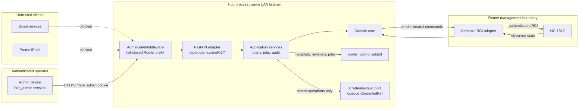
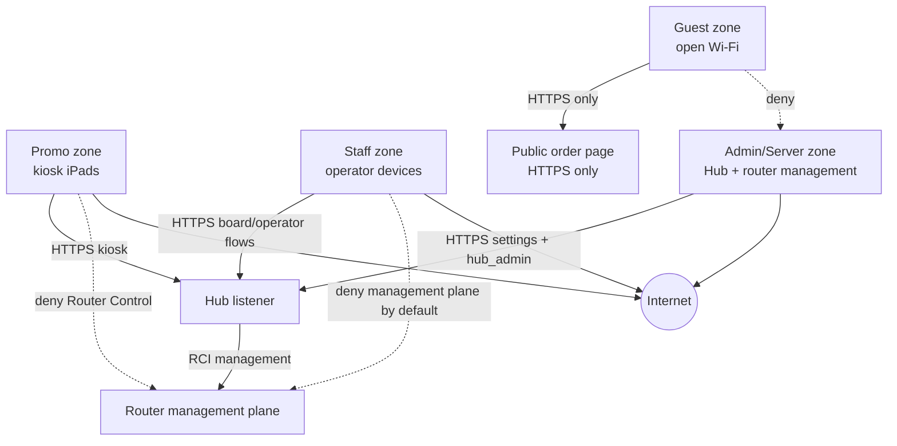
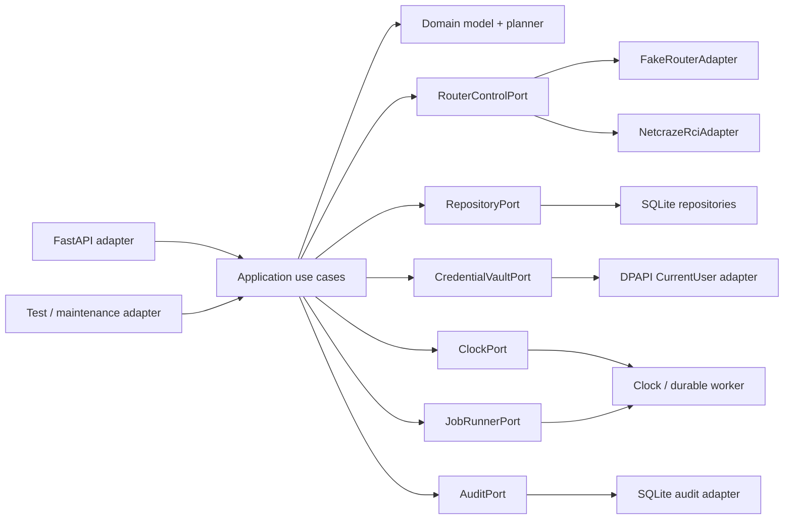
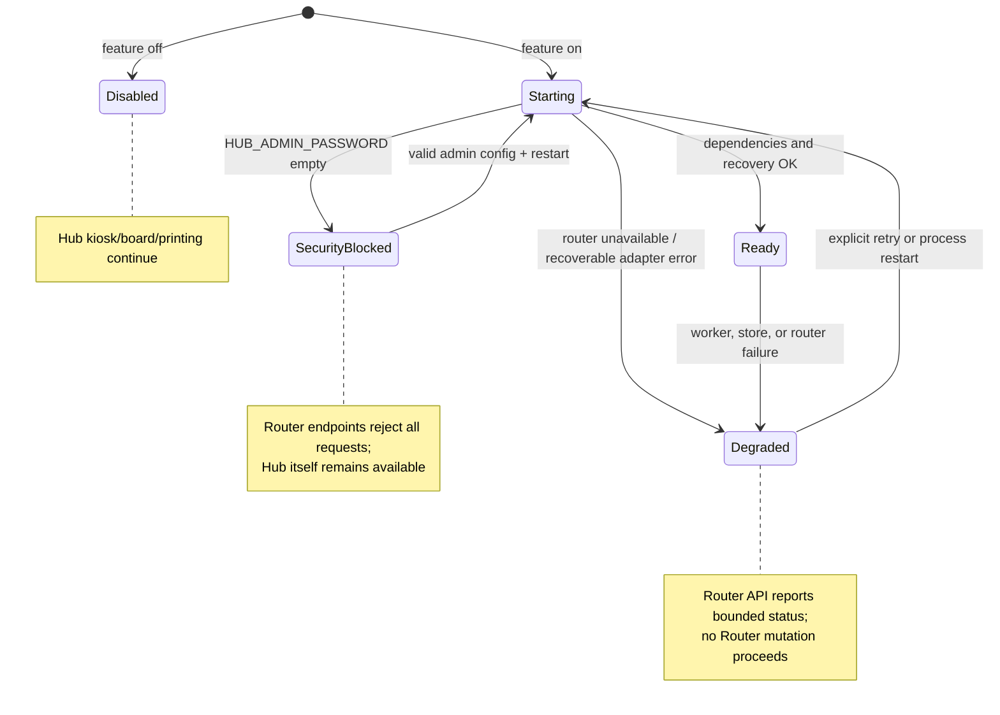
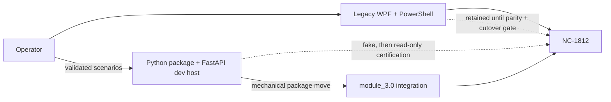

# Router Control: архитектура

## 1. Назначение и граница решения

Router Control разрабатывается в два этапа без смены языка и доменных контрактов:

1. После завершения Phase 0b в этом репозитории планируется создать переносимый Python package `router_control` и отдельный FastAPI dev host. Dev host нужен для лабораторного API и UI, но не входит в domain core. `ScanCursorIP` остаётся только legacy behavioral evidence.
2. После подтверждения поведения package механически переносится в `module_3.0/app/services/router_control/`. FastAPI adapter подключается к существующему Hub, его process resources и lifespan.

Целевой runtime — Python 3.11, FastAPI/Uvicorn и один процесс Hub. Отдельный production listener или sidecar для Router Control не создаётся. После интеграции API обслуживается тем же LAN listener Hub под prefix `/api/router-control/v1/`.

Архитектурное решение и отклонённые платформы зафиксированы в [ADR-001](adrs/0001-python-package-fastapi-host.md).

## 2. Архитектурные правила

- `domain` и `application` не импортируют FastAPI, vendor SDK, Windows UI или PowerShell.
- Domain оперирует `RouterId`, capabilities, desired/observed state, plans и managed ownership, а не RCI JSON или именами интерфейсов.
- Все обращения к роутеру проходят через ports; Netcraze/NDMS RCI существует только в adapter.
- Read-only operations могут выполняться параллельно. Mutations сериализуются по `RouterId`.
- Unknown model, firmware, capability или unsupported profile field запрещают write, но не read-only диагностику.
- Router identity определяется по устойчивому fingerprint (model + serial/MAC/vendor evidence), а не по IP, hostname, default gateway или имени `Wireguard0`.
- Router Control меняет и удаляет только ресурсы, для которых существует его ownership record.
- Любая mutation проходит unified lifecycle `preflight → identity → observe → backup → plan-preconditions → Confirm → Fail-safe Configuration → apply → read-back → verify → save/compensate`; ошибка приводит к compensation, а потеря связи полагается на router Fail-safe Configuration ([`contracts/RCI_POLICY.md`](contracts/RCI_POLICY.md)).
- Private keys, passwords, raw sessions и startup configuration не попадают в API response, plan diff, job payload, audit или diagnostics.
- Firmware/components в v1 только обнаруживаются; автоматические install/update не входят в boundary.

## 3. Trust и data flow



Trust boundary обязателен в двух направлениях:

- Browser никогда не получает router password, VPN private key, raw RCI session или startup-config. `CredentialRef` остаётся opaque.
- Router response считается untrusted input: adapter валидирует schema, command-level errors, identity и capability evidence до передачи domain.

`Promo` — имя сетевой зоны, а не application role или scope. Для Router Control не вводятся отдельные scopes для Promo или отдельная promo-аутентификация. Единственное основание доступа в существующем Hub UI — валидная `hub_admin` session.

## 4. Четыре network zones



NetworkPolicy определяет четыре firewall/VLAN zones: `Guest`, `Promo`, `Staff`, `Admin/Server`. Router Control API и router management plane принадлежат `Admin/Server`. Guest получает только локальную HTTPS order page; Guest, Promo и по умолчанию Staff не получают network path к management plane. Эти firewall rules дополняют, но не заменяют `hub_admin` на HTTP boundary.

NetworkPolicy реализуется после VPN/routes и не входит в API v0. До её появления API всё равно обязан быть fail-closed на общем listener.

## 5. Bounded contexts

| Bounded context | Ответственность | Не отвечает за |
|---|---|---|
| `RouterInventory` | `RouterId`, endpoint, fingerprint, model/firmware, capabilities, timestamped observations | Хранение credentials и применение config |
| `CredentialVault` | Opaque `CredentialRef`, create/rotate/delete secret, local DPAPI adapter | Возврат plaintext через API |
| `VpnLifecycle` | `VpnProfileArtifact`, profile validation, `TunnelAssignment`, desired/observed health | Vendor commands и firmware update |
| `Provisioning` | Preflight, immutable `ChangePlan`, confirmation, Fail-safe Configuration (primary; Safe Configuration vendor alias), apply, verify, compensation | Решение о network segmentation |
| `RoutingPolicy` | Managed `RouteSet`, public-destination validation, diff/ensure, ownership | Raw RCI commands и TrafficDiscovery |
| `JobsAudit` | Durable jobs, steps/checkpoints, leases, idempotency, append-only audit | Domain policy |
| `TrafficDiscovery` | Evidence, confidence/TTL и `RouteProposal` | Прямое изменение routes |
| `NetworkPolicy` | Guest/Promo/Staff/Admin presets и firewall/VLAN intent | Application auth и VPN profile parsing |

Связи между contexts идут через immutable identifiers и contracts. `TrafficDiscovery` может предложить `RouteProposal`, но только `RoutingPolicy` и `Provisioning` могут превратить подтверждённое предложение в mutation. Auto-apply допустим в будущем только для явно trusted policy.

## 6. Ports and adapters



Минимальные inbound ports — inventory/enroll, preflight, profile validation, plan/create, plan/confirm и job status/cancel. Outbound ports:

- `RouterControlPort`: identity, capabilities, observed state, safe-configuration lifecycle и allowlisted vendor-neutral mutations;
- `RepositoryPort`: routers, revisions, observations, ownership, plans, jobs и idempotency;
- `CredentialVaultPort`: secret write/use/rotate/delete без general-purpose plaintext read;
- `JobRunnerPort`: durable execution, recovery и per-router serialization;
- `AuditPort`: redacted append-only events;
- `ClockPort`: deterministic TTL, lease и test behavior.

Phase 1 использует `FakeRouterAdapter` и обязан проходить offline tests с запретом network sockets. `NetcrazeRciAdapter` появляется только в read-only Phase 2.

## 7. Prototype layout и перенос

Планируемое логическое разбиение package в этом репозитории:

```text
router_control/
  domain/
  application/
  ports/
  adapters/
    fake/
    persistence/
    secrets/
    netcraze/
  composition.py
dev_host/
  app.py
  routes.py
```

Это contract разделения, а не требование создать все каталоги в Phase 0. `dev_host` зависит от package; package не зависит от `dev_host` или FastAPI. Composition root выбирает adapters и возвращает один facade/runtime object. Поэтому интеграция не требует переписывать domain: package переносится под `app/services/router_control/`, меняются только imports и Hub composition adapter.

## 8. Failure isolation



Failure policy:

- Feature disabled: no adapter connection и no worker; Hub работает штатно.
- Missing `HUB_ADMIN_PASSWORD` при enabled Router Control: `SecurityBlocked`. Router prefix остаётся зарегистрированным и отвечает `503` с generic configuration error до вызова handler, а не становится публичным. Это feature-local blocked state, но не причина останавливать kiosk, board или printing.
- Ожидаемые Router Control composition, DB migration/recovery и worker startup failures перехватываются на feature boundary: facade переходит в `Degraded`, route registration и Hub startup продолжаются. Global Settings validation и ошибки вне этой границы сохраняют существующую семантику Hub; cancellation, interpreter-level failures и programming errors нельзя перехватывать без разбора.
- Router timeout, auth failure или wrong fingerprint влияют на конкретный router/job. Они не завершают Hub process.
- Ожидаемая feature-local Router Control exception не должна выходить из lifespan startup/shutdown. Ошибка логируется redacted и отражается в health state. Runtime recovery из `Degraded` начинается только по explicit operator retry или после process restart.
- Writes в `Degraded`/`SecurityBlocked` запрещены. **`SecurityBlocked`**: все `/api/router-control/v1/*` отвечают **`503`** до handler. **`Degraded`**: только ограниченный health/status (без mutations); read-only diagnostics redacted.

Не допускается ловить ошибку и продолжать mutation с частично собранными adapters. Composition возвращает либо целостный `Ready` runtime, либо явный disabled/degraded facade.

## 9. Strangler migration



Legacy WPF/PowerShell остаётся рабочим контуром, пока Python implementation не прошла:

1. Golden-behavior parity для inventory, plan/diff, apply, verify и recovery.
2. Fake/recorded/live test lanes на certified NC-1812 firmware.
3. Restore rehearsal: baseline → apply → verify → restore → reboot → baseline verify.
4. Operator acceptance и наблюдаемое стабильное окно.

До cutover запрещено совместное ownership одного router resource. После cutover legacy переводится в read-only/disabled режим и только затем удаляется. Legacy scripts могут служить evidence и test oracle, но не импортируются и не вызываются как final core.

## 10. Точные integration touchpoints в `module_3.0`

Интеграция выполняется как ограниченный набор изменений:

| Touchpoint | Изменение |
|---|---|
| `app/services/router_control/` | Перенести Python package; сохранить разделение `domain/application/ports/adapters`. FastAPI imports здесь запрещены, кроме отдельного Hub composition module при необходимости. |
| `app/api/routes/router_control.py` | Добавить тонкий `APIRouter` с prefix `/api/router-control/v1`; DTO/HTTP errors преобразуются здесь, use cases вызываются через dependency. Raw RCI endpoint отсутствует. |
| `app/api/factory.py::_register_routes` | Импортировать новый routes module и один раз вызвать `app.include_router(...)`. |
| `app/core/bootstrap.py::ProcessResources` | Добавить один process-wide `router_control` facade/runtime field. |
| `app/core/bootstrap.py::_build_resources` | Собрать Router Control через composition root. Ошибки feature-local dependencies преобразовать в disabled/degraded facade; не прерывать построение monitor, cutter, printing, orders и board. |
| `app/api/factory.py::_bind_singletons` | Добавить имя `router_control` в binding `ProcessResources → app.state`. |
| `app/api/deps.py` | Добавить `get_router_control(request)`, использующий существующий state-first `get_singleton`. |
| `app/core/lifespan.py::app_lifespan` | Выполнить recovery/start Router Control durable worker после bootstrap и зарегистрировать его для `stop()`. Ожидаемые feature-local start/stop failures оборачиваются boundary handling и не ломают Hub lifespan. |
| `app/settings.py::Settings` | Добавить typed, redacted Router Control flags/paths/timeouts. Secrets хранятся как `SecretStr` или opaque vault refs. Не помещать credentials в effective-config log. |
| `app/core/middleware.py::AdminGateMiddleware` | До общего `if not settings.hub_admin_enabled: pass` добавить специальную проверку `path == "/api/router-control/v1" or path.startswith("/api/router-control/v1/")`: при пустом password всегда `503`; без valid `hub_admin` cookie всегда `401`; с valid cookie продолжить. Затем добавить prefix в `_ADMIN_GATED_API_PREFIXES` для обычного enabled-path. |
| `static/settings.html` | Добавить Router Control panel внутри существующей защищённой `/settings`: availability, router status, preflight, redacted plan и explicit Confirm. Не создавать публичную отдельную admin page. |
| `static/settings.js` | Добавить вызовы только к `/api/router-control/v1/*`; обрабатывать `401` через существующий login flow, `503` как security/degraded status; не сохранять secrets в DOM, URL или browser storage. |
| `scripts/install_hub.ps1` | Добавить не-secret defaults, создание data directory/ACL и dependency/install checks. При enabled feature требовать operator-supplied `HUB_ADMIN_PASSWORD`, не генерировать и не печатать router credentials. Включить `data/router_control.sqlite3` и encrypted artifacts в backup/restore/uninstall policy. |
| `requirements.txt` | Добавить только реально используемые Python dependencies package/adapters; FastAPI уже принадлежит host. |
| `tests/` | Добавить factory wiring, lifespan isolation, middleware fail-closed, settings redaction, settings-page smoke, no-network unit и degraded-start tests. |

### Auth contract общего listener

`ApiKeyMiddleware` не является достаточной защитой: он optional и по текущему contract пропускает reads. Router Control защищает и reads, и writes существующей `hub_admin` session.

Порядок решения для любого `/api/router-control/` request:

1. `HUB_ADMIN_PASSWORD` пуст — `503`, без вызова handler. Если feature enabled, это также фиксируется как `SecurityBlocked`.
2. Password настроен, но `hub_admin` cookie отсутствует/невалидна — `401` и ссылка на `/login`.
3. Cookie валидна — request проходит к route и далее к feature policy.
4. Router Control disabled — уже аутентифицированный caller получает только ограниченный disabled status, если он предусмотрен API contract; остальные Router routes недоступны.

Никаких новых scopes, promo tokens или bypass по source IP нет. Network zone и source IP не являются authentication.

## 11. Persistence и process ownership

Router Control использует отдельный `data/router_control.sqlite3`. В нём хранятся metadata, desired/observed revisions, ownership, plans, durable jobs, idempotency и audit. JSON/CONF допустимы только как import/export или hashed artifacts.

Process ownership следует существующему Hub pattern:

- `bootstrap` создаёт один runtime на process;
- `factory` связывает его с `app.state`;
- `deps` предоставляет state-first access;
- `lifespan` запускает recovery/workers и выполняет graceful stop.

Mutation lease и lock привязаны к `RouterId`. `applied_revision` меняется только после read-back и postcondition verification.

## 12. Архитектурные acceptance criteria

- Один Python domain package работает за fake adapter без FastAPI и без network.
- Dev host и будущий Hub adapter вызывают одинаковые application use cases.
- `/api/router-control/v1/*` использует общий Hub listener и fail-closed `hub_admin`.
- Пустой admin password никогда не открывает Router endpoints.
- Router Control disabled/degraded не блокирует Hub startup, kiosk, board или printing.
- В API/domain отсутствуют RCI JSON, raw command endpoints и invented promo scopes.
- Four-zone policy отделена от HTTP auth и описывает `Guest`, `Promo`, `Staff`, `Admin/Server`.
- Legacy остаётся strangler fallback до parity, restore rehearsal и явного cutover.

## 13. Phase 0b contracts (Wave 1)

| Contract | Scope |
|---|---|
| [`contracts/RCI_POLICY.md`](contracts/RCI_POLICY.md) | Capability-family allowlist, transport hypotheses, unified lifecycle |
| [`contracts/HARDWARE_GATES.md`](contracts/HARDWARE_GATES.md) | Gates A/B/C/D, certification tuple, fail-closed table |
| [`contracts/SECURITY_OPS.md`](contracts/SECURITY_OPS.md) | `hub_admin` fail-closed, Confirm, CredentialRef/DPAPI, audit, zones |

Index: [`contracts/README.md`](contracts/README.md). Phase 0b opens **no** hardware gates.
