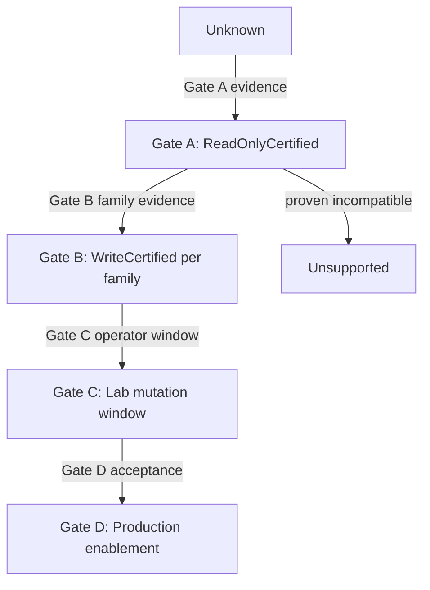

# Hardware safety gates contract

## For agents

| Gate | Opens | Phase 0b |
|---|---|---|
| **A** | Read-only transport + identity certification | **Closed** |
| **B** | Per-capability-family write certification | **Closed** |
| **C** | Explicit laboratory mutation window | **Closed** |
| **D** | Production enablement on event tuple | **Closed** |
| Fail-closed | Unknown firmware/capability/profile, identity mismatch, stale/missing evidence, uncertified capability, closed window for applicable path (lab C / production D) → **no write dispatch** | Always |
| Raw `5.01` | Preserve unclassified; **do not** normalize to `5.1` | [`COMPATIBILITY.md`](../COMPATIBILITY.md) |
| Trace | [`RCI_POLICY.md`](RCI_POLICY.md), [`COMPATIBILITY.md`](../COMPATIBILITY.md), [`CANONICAL.md`](../CANONICAL.md), ADR-0004, [`SCENARIOS.md`](SCENARIOS.md) |

---

## 1. Certification tuple (exact key)

Write certification привязана к **sanitized evidence package** (no secrets):

| Field | Requirement |
|---|---|
| `model` | e.g. `Netcraze Ultra NC-1812` |
| `firmware_version` | Full version string as observed (raw `5.01` allowed as unclassified until snapshot completes) |
| `build` | Build identifier when captured |
| `update_channel` | Main / Preview / … as observed |
| `component_set_digest` | Hash of installed component list |
| `device_fingerprint` | Model + serial/MAC/vendor evidence (redacted in shared fixtures) |
| `evidence_recorded_at` | UTC timestamp |
| `evidence_locator` | Internal artifact reference (not in public docs) |

Different tuple → prior certifications **do not inherit**; status returns to detect-only until new gate passage.

## 2. Sanitized evidence package

Evidence package for each gate passage contains:

- redacted command transcripts (no passwords, keys, sessions, startup-config content);
- identity snapshot fields above;
- pass/fail checklist results;
- adapter version and operator actor reference;
- optional synthetic AWG keys and documentation-only addresses only in lab fixtures.

Packages never include: router password, VPN private keys, preshared keys, raw session cookies, full startup-config dumps in shared storage.

## 3. Gates A / B / C / D (separate)

| Gate | Purpose | Authorizes |
|---|---|---|
| **A — Read-only certification** | RCI transport, auth, identity reads, targeted observe | Read-only adapter operations; inventory/preflight observe |
| **B — Write certification** | Per capability-family apply/read-back/verify/compensation on tuple | Automated write dispatch **for that family only** |
| **C — Laboratory mutation window** | Time-boxed, operator-approved lab changes on dedicated NC-1812 | Execute certified write sequences in lab; not event production |
| **D — Production enablement** | Operator acceptance, restore rehearsal, strangler cutover readiness | Event/production automated writes on enrolled router |

Gates are **independent switches**: opening C without B does not authorize writes; opening B without C does not authorize **lab** mutations; **production** writes require Gate D (and Gate B per family), **not** an open Gate C window; D requires B (+ successful C history where applicable) and security/ops gates.

**Phase 0b opens none of A/B/C/D.** Documentation and fake/domain strategy/spec only; recorded evidence and live Gate A–D lanes remain closed ([`TEST_STRATEGY.md`](TEST_STRATEGY.md) §2).

## 4. Certification status transitions

`RouterCapability.certification_status` ([`DOMAIN_MODEL.md`](../DOMAIN_MODEL.md)):

| Status | Meaning |
|---|---|
| `Unknown` | No gate A evidence for tuple |
| `ReadOnlyCertified` | Gate A passed; writes blocked |
| `WriteCertified` | Gate B passed for one or more families (record per family) |
| `Unsupported` | Evidence proves family incompatible on tuple |

Transitions:

- `Unknown → ReadOnlyCertified` — Gate A package accepted
- `ReadOnlyCertified → WriteCertified` — Gate B package for family(ies)
- `ReadOnlyCertified → Unsupported` — negative certification
- **Expiry/revocation** — firmware change, component change, evidence age policy, or failed re-verify → downgrade toward `Unknown` or family-specific revoke; writes fail closed immediately

## 5. Fail-closed table (write dispatch)

| Condition | Write dispatch |
|---|---|
| Unknown firmware/build/channel/components | **Blocked** |
| Unknown or unsupported capability/profile field | **Blocked** |
| Identity mismatch vs enrolled `RouterId` | **Blocked** |
| Stale or missing observation evidence | **Blocked** |
| Uncertified capability family (no Gate B) | **Blocked** |
| **Lab** mutation path: Gate C window closed | **Blocked** (lab dispatch only) |
| **Production** mutation path: Gate D not satisfied | **Blocked** (production dispatch only) |
| `SecurityBlocked` (empty `HUB_ADMIN_PASSWORD`) | **Blocked** at HTTP boundary |
| Feature `Degraded` | **Blocked** for mutations |

Read-only diagnostics (when **not** `SecurityBlocked`) may continue under `Degraded` or `Ready` where safe and redacted.

## 6. Lab checklists (recording templates)

### 6.1 RCI transport (Gate A)

- [ ] Local HTTPS endpoint reachable with certificate validation policy
- [ ] Digest auth challenge and session establishment recorded (redacted)
- [ ] Identity read matches enrolled fingerprint
- [ ] Command-level error normalization captured
- [ ] 401 re-auth behavior (single retry) captured or marked unknown
- [ ] `"continued": true` polling captured or marked not observed
- [ ] Timeout behavior documented

### 6.2 Fail-safe Configuration (Gate B prerequisite for disruptive families)

- [ ] Activation/status commands recorded (provisional shapes)
- [ ] Changes remain outside startup config until save
- [ ] Confirm/save path recorded
- [ ] Timeout reboot restores last saved config (loss-of-management test)
- [ ] Compensation path documented when session persists

### 6.3 AmneziaWG (Gate B family)

- [ ] Accepted profile field set enumerated; unknown fields rejected
- [ ] Greenfield import + switch between two synthetic profiles
- [ ] Read-back proves no silent field drop
- [ ] Handshake and application reachability through tunnel
- [ ] Save, reboot, health re-check, compensation, baseline restore

### 6.4 Route benchmark (Gate B + scale policy)

Trials at **100 / 1,000 / 5,000** managed routes ([`COMPATIBILITY.md`](../COMPATIBILITY.md)):

- [ ] Plan/diff and apply/read-back timings
- [ ] Save and reboot recovery
- [ ] Backup/restore rehearsal
- [ ] Production ceiling = largest passing size meeting SLO

## 7. Firmware note: raw `5.01`

Current deployment observation uses raw string **`5.01`**. It must be stored and displayed **as observed**. Do **not** normalize to **`5.1`** or assume equivalence to NDMS 5.1 release train until identity snapshot and vendor mapping are recorded ([`COMPATIBILITY.md`](../COMPATIBILITY.md), [`CANONICAL.md`](../CANONICAL.md) §6).

## 8. Links

- HTTP/API surface: [`API_CONTRACT.md`](API_CONTRACT.md)
- Test strategy and evidence lanes: [`TEST_STRATEGY.md`](TEST_STRATEGY.md)
- RCI allowlist and lifecycle: [`RCI_POLICY.md`](RCI_POLICY.md)
- Security and Confirm: [`SECURITY_OPS.md`](SECURITY_OPS.md)
- Contracts index: [`README.md`](README.md)
