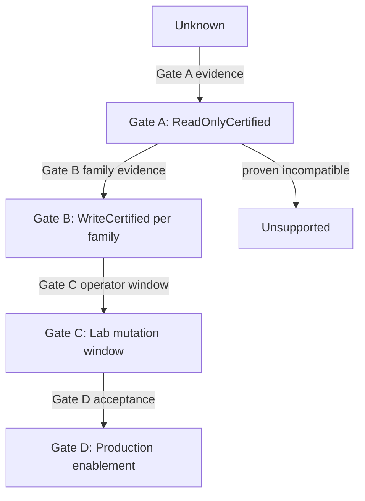

# Hardware safety gates contract

## For agents

| Gate | Opens | Current posture (2026-07-23) |
|---|---|---|
| **A** | Read-only transport + identity certification | **Open ReadOnlyCertified** (exact NC-1812 lab tuple) |
| **B** | Per-capability-family write certification | **Completed_failed** — fail_safe dual trials (`fail-safe-20260723T110000Z` current + `fail-safe-20260723T094500Z` previous); AWG trial also completed_failed; **not WriteCertified** |
| **C** | Explicit laboratory mutation window | **Closed** (`completed_failed`; second window closed 2026-07-23) |
| **D** | Production enablement on event tuple | **Closed** |
| Dedicated lab | Project-owned NC-1812; program vs action — [`DEDICATED_ROUTER_LAB_POLICY.md`](../DEDICATED_ROUTER_LAB_POLICY.md) | Controlled config churn/reboots/restores only under exact T4 Human Gate; no production risk claim |
| Milestone | M0–M5 complete; **P3 topology safety closure complete** (2026-07-23); **M4 not live-ready** | Dedicated HW validation = authorized parallel lane; explicit `--source-address` on overlapping-subnet labs; live trials deferred until fresh exact T4 Human Gate per campaign |
| Gate D (fail-safe) | Missing/`None`/unknown `gate_d_closed` **denies** — mirror Gate C required state | Explicit `closed` required immediately pre-I/O |
| Fail-closed | Unknown firmware/capability/profile, identity mismatch, stale/missing evidence, uncertified capability, closed window → **no write dispatch** | Always |
| Raw `5.01` | Preserve unclassified; **do not** normalize to `5.1` | [`COMPATIBILITY.md`](../COMPATIBILITY.md) |
| Trace | [`RCI_POLICY.md`](RCI_POLICY.md), [`COMPATIBILITY.md`](../COMPATIBILITY.md), [`CANONICAL.md`](../CANONICAL.md), ADR-0004, [`SCENARIOS.md`](SCENARIOS.md) |

## Typed capability families (certification posture)

| Typed family ID | Product surface | Gate B posture (2026-07-23) | Registry / dispatch |
|---|---|---|---|
| `fail_safe` | Safe Configuration timer/reboot | **completed_failed** trials (`fail-safe-20260723T110000Z` current + `fail-safe-20260723T094500Z` previous); not WriteCertified; not standing-executable; offline SSH diagnosis then fresh exact T4 required | Empty shape registry; `--execute` requires digest-bound STATUS+receipt in fresh T4 auth |
| `dhcp` | Local DHCP policies (future) | Not certified | Empty registry; default-deny |
| `dns` | Local DNS policies (future) | Not certified | Empty registry; default-deny |
| `AmneziaWG` | VPN profiles (parallel lane) | **completed_failed** trial; not WriteCertified | Empty registry; typed allowlist only under Gate B/C trial auth |

No marker file or empty touch-marker unlocks live `--execute`; digest-faithful STATUS lineage (`p1_complete`/`p2_complete`/`p3_complete`) plus verification receipt required.

---

## 1. Certification tuple (exact key)

Write certification привязана к **sanitized evidence package** (no secrets):

| Field | Requirement |
|---|---|
| `model` | e.g. `Netcraze Ultra NC-1812` |
| `firmware_version` | Full version string as observed (raw `5.01` allowed as unclassified until snapshot completes) |
| `build` | Build identifier when captured |
| `update_channel` | Main / Preview / … as observed |
| `component_set_digest` | Hash of sorted installed component IDs under named algorithm (`component-set-v2` observed; legacy list shape uses separate algorithm id) |
| `device_fingerprint` | Model + serial/MAC/vendor evidence (redacted in shared fixtures) |
| `evidence_recorded_at` | UTC timestamp |
| `evidence_locator` | Internal artifact reference (not in public docs) |

Different tuple → prior certifications **do not inherit**; status returns to detect-only until new gate passage.

## 2. Sanitized evidence package

Evidence package for each gate passage contains:

- redacted command transcripts (no passwords, keys, sessions, startup-config content);
- identity snapshot fields above;
- pass/fail checklist results;
- adapter version and operator actor reference;
- optional synthetic AWG keys and documentation-only addresses only in lab fixtures.

Packages never include: router password, VPN private keys, preshared keys, raw session cookies, full startup-config dumps in shared storage.

**Pre-component startup backup (operator CLI):** fixed `GET /ci/startup-config.txt` over host-key-pinned SSH tunnel; response reading is capped at 4 MiB + one detection byte. Before vault/network access, typed Gate A config must match mandatory STATUS/evidence, the certified device fingerprint digest, and the actual SSH host-key digest/algorithm. The CLI has no backup-root override: it atomically publishes only a DPAPI-encrypted artifact + sanitized metadata pair under repository `data/backups/`, removing either side on failure. It does **not** install components, reboot, or open Gates B/C/D — backup is evidence preparation only until Gate B/C checklists apply.

**Gate B/C AWG trial (2026-07-21, closed failed):** human-approved `CertificationTrialAuthorized` lab trial for capability family **AmneziaWG** is recorded in [`gate-b-c-awg-authorization.json`](../gate-b-c-awg-authorization.json), [`gate-b-awg-certification-result.json`](../gate-b-awg-certification-result.json), and [`STATUS.yaml`](../STATUS.yaml). Trial outcome **`certification_failed_all_candidates_handshake`** — this is **not** `WriteCertified`. [`gate-a-certification.json`](../gate-a-certification.json) keeps nested gates B/C/D **closed** so Gate A `ReadOnlyCertified` observe remains valid. Gate **C** lab window closed; Gate **D** stays closed. AWG write operations use a **typed allowlist** with **`write_shapes_registered: false`** — unregistered shapes fail closed (`CommandShapeUnknown`); agents must **never invent** NC-1812 Fail-safe/AWG/save/reboot command bodies. Operator runbook: [`OPERATOR_GATE_B_C_AWG.md`](../OPERATOR_GATE_B_C_AWG.md).

**Fail-safe timer discovery runner (2026-07-22 prep; 2026-07-23 live trials closed):** typed host-key-pinned runner for exact CLI `system configuration fail-safe timer reboot 60` — separate `FailSafeTypedOperation`, trial authorization schema, atomic `data/artifacts/fail-safe-trials/<trial_id>.consumed` replay guard, verified session close before TCP outage poll, sanitized evidence only. Trials `fail-safe-20260723T094500Z` and retry `fail-safe-20260723T110000Z` both consumed **completed_failed** (same `sealed_cli_dispatch` failure class; VPN absent on second; root cause unproven; result sha256 `c39cc40f…` / `ecf9b0bb…`; not WriteCertified). Failure evidence adds allowlisted `error_code` / `failure_stage` / `dispatch_attempted` and sealed `command_result` meta only. Operator runbook: [`OPERATOR_GATE_FAIL_SAFE.md`](../OPERATOR_GATE_FAIL_SAFE.md); schema: [`schemas/fail-safe-trial-authorization.schema.json`](../schemas/fail-safe-trial-authorization.schema.json); CLI: `scripts/certify-gate-b-fail-safe.py`. **Offline SSH exec-channel diagnosis**, then **fresh exact T4 required** before third attempt.

## 3. Gates A / B / C / D (separate)

```mermaid
flowchart TB
  Unknown["Unknown"]
  RO["Gate A: ReadOnlyCertified"]
  WC["Gate B: WriteCertified per family"]
  Unsup["Unsupported"]
  Lab["Gate C: Lab mutation window"]
  Prod["Gate D: Production enablement"]

  Unknown -->|"Gate A evidence"| RO
  RO -->|"Gate B family evidence"| WC
  RO -->|"proven incompatible"| Unsup
  WC -->|"Gate C operator window"| Lab
  Lab -->|"Gate D acceptance"| Prod
```

| Gate | Purpose | Authorizes |
|---|---|---|
| **A — Read-only certification** | RCI transport, auth, identity reads, targeted observe | Read-only adapter operations; inventory/preflight observe |
| **B — Write certification** | Per capability-family apply/read-back/verify/compensation on tuple | Automated write dispatch **for that family only** |
| **C — Laboratory mutation window** | Time-boxed, operator-approved lab changes on dedicated NC-1812 | Execute certified write sequences in lab; not event production |
| **D — Production enablement** | Operator acceptance, restore rehearsal, strangler cutover readiness | Event/production automated writes on enrolled router |

Gates are **independent switches**: opening C without B does not authorize writes; opening B without C does not authorize **lab** mutations; **production** writes require Gate D (and Gate B per family), **not** an open Gate C window; D requires B (+ successful C history where applicable) and security/ops gates.

**Phase 0b (historical):** opened none of A/B/C/D. Documentation and fake/domain strategy/spec only; recorded evidence and live Gate A–D lanes remained closed ([`TEST_STRATEGY.md`](TEST_STRATEGY.md) §2).

**Current posture (2026-08-05):** Gate **A** open **ReadOnlyCertified** (SSOT post-WG rebind #2 — evidence `data/artifacts/gate-a-probe-post-wireguard-install-192.168.2.1-20260731.json`; rebind #1 `gate-a-probe-newrouter-…` **SUPERSEDED**); Gate **B** **completed_failed** (fail_safe historical trials + AWG trial completed_failed; not WriteCertified); Gate **C** **closed** `completed_failed`; Gate **D** **closed**; registries empty; `write_shapes_registered` false; **`tunnel_healthy` DEVICE-CONFIRMED** (first real handshake §M-24..§M-26); **`SET_IP_ADDRESS` + `wireguard_ip_global` DEVICE-VERIFIED** (§M-24/M-27); traffic via tunnel **device-verified reversible** (§M-27). **Next task:** `local-hub-vpn-real-peer-autoconnect-continuation` per [`STATUS.yaml`](../STATUS.yaml) `next_task`. **Parallel deferred:** kill-switch/named policy **unresolved**; **`CLEAR_IP_GLOBAL` on teardown** not device-proven. Session handoff: [`SESSION_HANDOFF_REAL_ROUTER_2026-08-02.md`](../SESSION_HANDOFF_REAL_ROUTER_2026-08-02.md).

## 4. Certification status transitions

`RouterCapability.certification_status` ([`DOMAIN_MODEL.md`](../DOMAIN_MODEL.md)):

| Status | Meaning |
|---|---|
| `Unknown` | No gate A evidence for tuple |
| `ReadOnlyCertified` | Gate A passed; writes blocked |
| `WriteCertified` | Gate B passed for one or more families (record per family) |
| `CertificationTrialAuthorized` | Gate B **trial** authorization for one capability family — **not** `WriteCertified`; recorded in [`gate-b-c-awg-authorization.json`](../gate-b-c-awg-authorization.json) for AWG lab prep |
| `Unsupported` | Evidence proves family incompatible on tuple |

Transitions:

- `Unknown → ReadOnlyCertified` — Gate A package accepted
- `ReadOnlyCertified → WriteCertified` — Gate B package for family(ies)
- `ReadOnlyCertified → Unsupported` — negative certification
- **Expiry/revocation** — firmware change, component change, evidence age policy, or failed re-verify → downgrade toward `Unknown` or family-specific revoke; writes fail closed immediately

## 5. Fail-closed table (write dispatch)

| Condition | Write dispatch |
|---|---|
| Unknown firmware/build/channel/components | **Blocked** |
| Unknown or unsupported capability/profile field | **Blocked** |
| Identity mismatch vs enrolled `RouterId` | **Blocked** |
| Stale or missing observation evidence | **Blocked** |
| Uncertified capability family (no Gate B) | **Blocked** |
| **Lab** mutation path: Gate C window closed | **Blocked** (lab dispatch only) |
| **Production** mutation path: Gate D not satisfied | **Blocked** (production dispatch only) |
| `SecurityBlocked` (empty `HUB_ADMIN_PASSWORD`) | **Blocked** at HTTP boundary |
| Feature `Degraded` | **Blocked** for mutations |

Read-only diagnostics (when **not** `SecurityBlocked`) may continue under `Degraded` or `Ready` where safe and redacted.

## 6. Lab checklists (recording templates)

### 6.1 RCI transport (Gate A)

Authenticated encrypted transport to local RCI is required. Accept **either**:

- [ ] Local HTTPS endpoint reachable with certificate validation policy, **or**
- [ ] Host-key-pinned SSH local forward to verified router management RCI HTTP (port 80); pin verified **before** password auth; artifact records `transport_security: ssh_tunnel` and public SHA256 fingerprint digest (no raw host key)

Non-certifying paths (plain HTTP on LAN, unpinned SSH, HTTPS without cert validation) may be used for lab discovery only — they do **not** satisfy this checklist item.

- [ ] Digest or interactive auth challenge and session establishment recorded (redacted)
- [ ] Identity read matches enrolled fingerprint
- [ ] Command-level error normalization captured
- [ ] 401 re-auth behavior (single retry) captured or marked unknown
- [ ] `"continued": true` polling captured or marked not observed
- [ ] Timeout behavior documented

### 6.2 Fail-safe Configuration (Gate B prerequisite for disruptive families)

- [ ] Activation/status commands recorded (provisional shapes)
- [ ] Changes remain outside startup config until save
- [ ] Confirm/save path recorded
- [ ] Timeout reboot restores last saved config (loss-of-management test)
- [ ] Compensation path documented when session persists

### 6.3 AmneziaWG (Gate B family)

- [ ] Accepted profile field set enumerated; unknown fields rejected
- [ ] Greenfield import + switch between two synthetic profiles
- [ ] Read-back proves no silent field drop
- [ ] Handshake and application reachability through tunnel
- [ ] Save, reboot, health re-check, compensation, baseline restore

### 6.4 Route benchmark (Gate B + scale policy)

Trials at **100 / 1,000 / 5,000** managed routes ([`COMPATIBILITY.md`](../COMPATIBILITY.md)):

- [ ] Plan/diff and apply/read-back timings
- [ ] Save and reboot recovery
- [ ] Backup/restore rehearsal
- [ ] Production ceiling = largest passing size meeting SLO

## 7. Firmware note: raw `5.01`

Current deployment observation uses raw string **`5.01`**. It must be stored and displayed **as observed**. Do **not** normalize to **`5.1`** or assume equivalence to NDMS 5.1 release train until identity snapshot and vendor mapping are recorded ([`COMPATIBILITY.md`](../COMPATIBILITY.md), [`CANONICAL.md`](../CANONICAL.md) §6).

## 8. Links

- HTTP/API surface: [`API_CONTRACT.md`](API_CONTRACT.md)
- Test strategy and evidence lanes: [`TEST_STRATEGY.md`](TEST_STRATEGY.md)
- RCI allowlist and lifecycle: [`RCI_POLICY.md`](RCI_POLICY.md)
- Security and Confirm: [`SECURITY_OPS.md`](SECURITY_OPS.md)
- Dedicated lab policy: [`DEDICATED_ROUTER_LAB_POLICY.md`](../DEDICATED_ROUTER_LAB_POLICY.md)
- Contracts index: [`README.md`](README.md)
